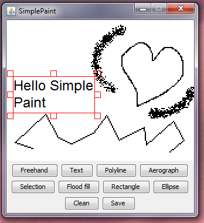
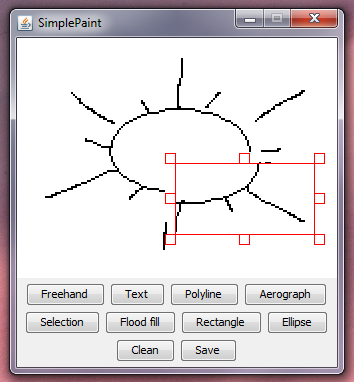

# Simple Paint
Simple paint is an application to show several graphical algoritms in use. It shows how to solve some common problems like fill limited areas with color (what's called flood fill), how to create text, selections, polylines, areographs, etc.

## Screenshots
Here are a couple of screenshots showing how the application looks like. It's a simple one, but it shows how a painting application can be done.

### Text tool:

### Selection tool:

Check it out and feel free to use its code for your own purposes.